# Lab3 操作指南

## 一、下载安装文件

1. **下载VirtualBox安装文件**
   - 从官方网站或可信源下载VirtualBox的安装文件。
   - Скачайте установочный файл VirtualBox с официального сайта или доверенного источника.
<div align="center">
  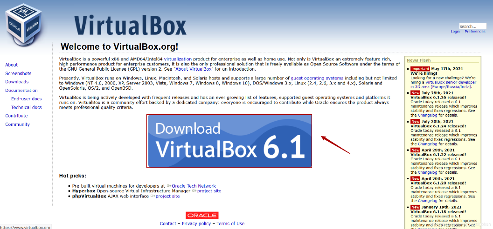
  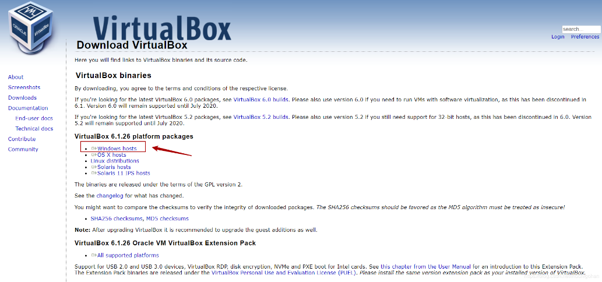
</div>

2. **下载Ubuntu 18.04安装文件**
   - 访问清华镜像源：[https://mirrors.tuna.tsinghua.edu.cn/ubuntu-releases/18.04/](https://mirrors.tuna.tsinghua.edu.cn/ubuntu-releases/18.04/ )
   - 下载Ubuntu 18.04的安装文件。
   - Перейдите на зеркало Tsinghua: [https://mirrors.tuna.tsinghua.edu.cn/ubuntu-releases/18.04/](https://mirrors.tuna.tsinghua.edu.cn/ubuntu-releases/18.04/ )
   - Скачайте установочный файл Ubuntu 18.04.
<div align="center">
  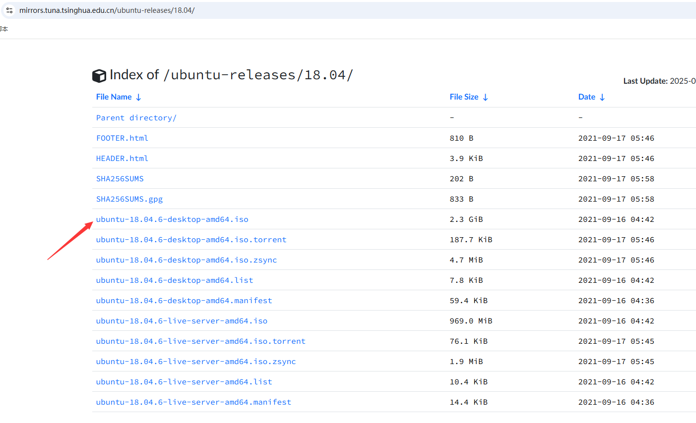
</div>

## 二、安装VirtualBox

- 按照常规软件安装步骤安装VirtualBox。
- Установите VirtualBox, следуя стандартным шагам установки программ.
<div align="center">
  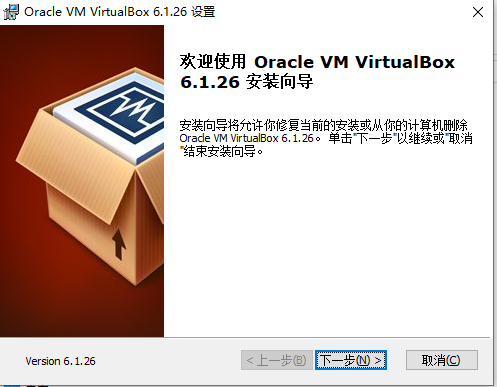
  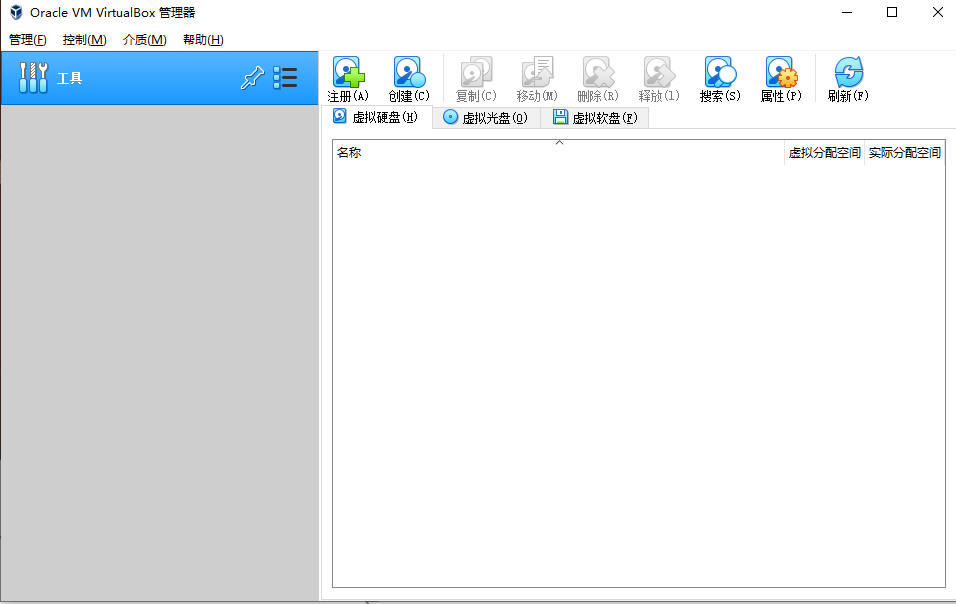
</div>

## 三、虚拟机安装

1. **创建虚拟机**
   - 在VirtualBox中创建一个新的虚拟机。
   - Создайте новую виртуальную машину в VirtualBox.
<div align="center">
  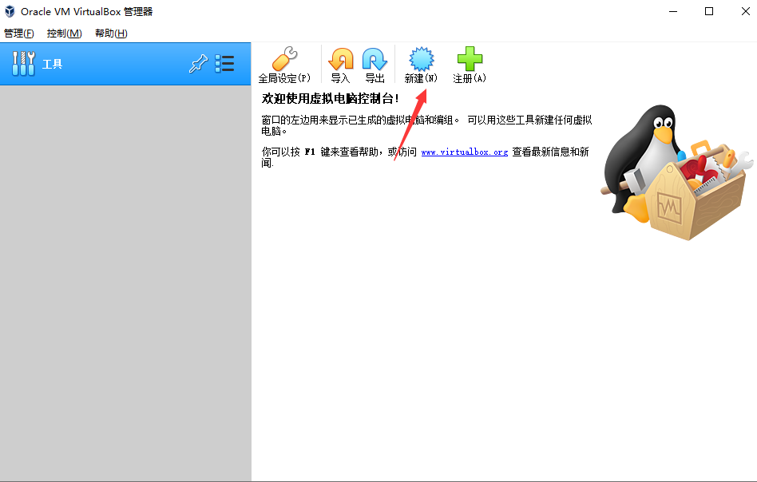
  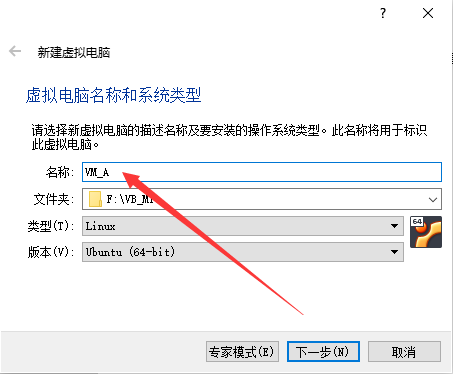
  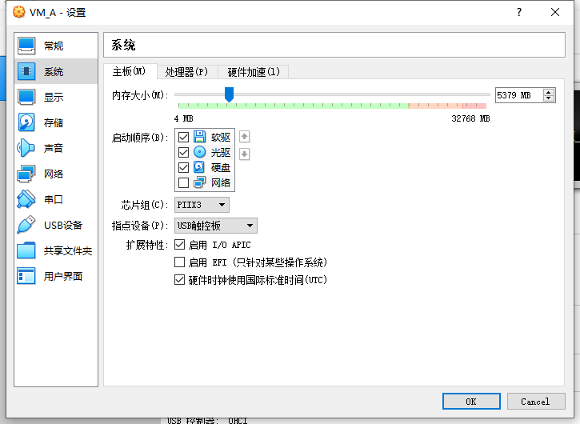
  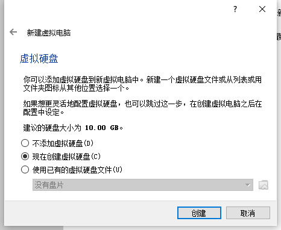
  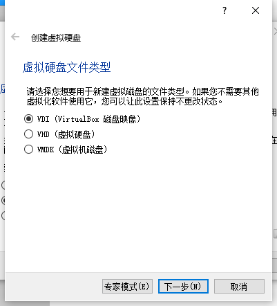
  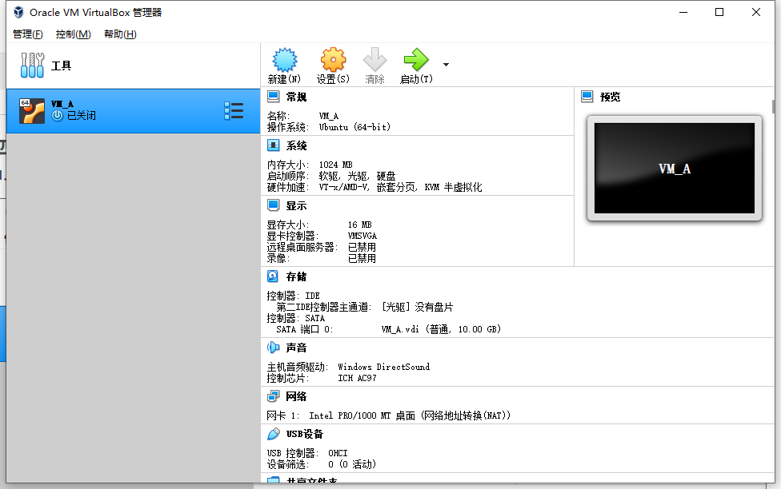
</div>

2. **配置虚拟机**
   - 点击“设置”->“存储”->“选择虚拟盘”。
   - 选择之前下载的Ubuntu 18.04安装文件。
   - Нажмите «Настройки» -> «Хранение» -> «Выбрать виртуальный диск».
   - Выберите ранее скаченный установочный файл Ubuntu 18.04.
<div align="center">
  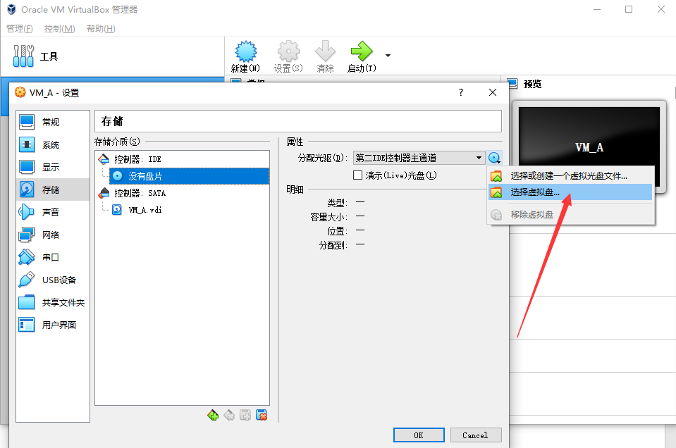
</div>

3. **设置加载镜像**
   - 确保虚拟机配置中加载了Ubuntu 18.04的安装镜像。
   - Убедитесь, что в конфигурации виртуальной машины загружен установочный образ Ubuntu 18.04.
<div align="center">
  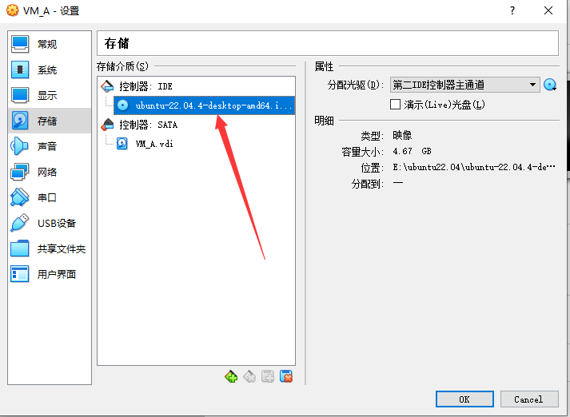
</div>

4. **设置网络为NAT模式**
   - 在虚拟机网络设置中，选择NAT模式以确保虚拟机能够访问外部网络。
   - В настройках сети виртуальной машины выберите режим NAT, чтобы виртуальная машина могла получать доступ к внешней сети.
<div align="center">
  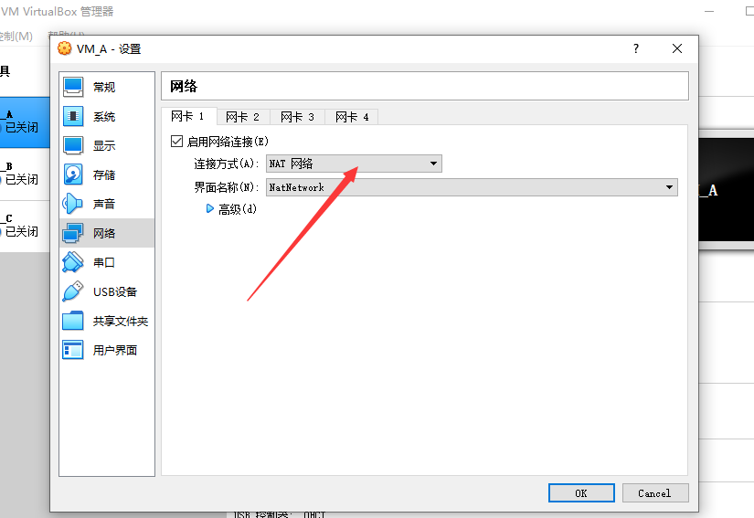
</div>

5. **启动虚拟机**
   - 启动创建的虚拟机，开始安装Ubuntu 18.04.
   - Запустите созданную виртуальную машину и начните установку Ubuntu 18.04.
<div align="center">
  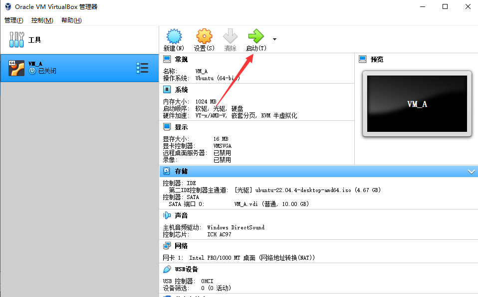
</div>

## 四、安装Ubuntu 18.04

- 按照以下提示完成Ubuntu 18.04的安装过程.
- Следуйте указаниям ниже, чтобы завершить установку Ubuntu 18.04.
<div align="center">
  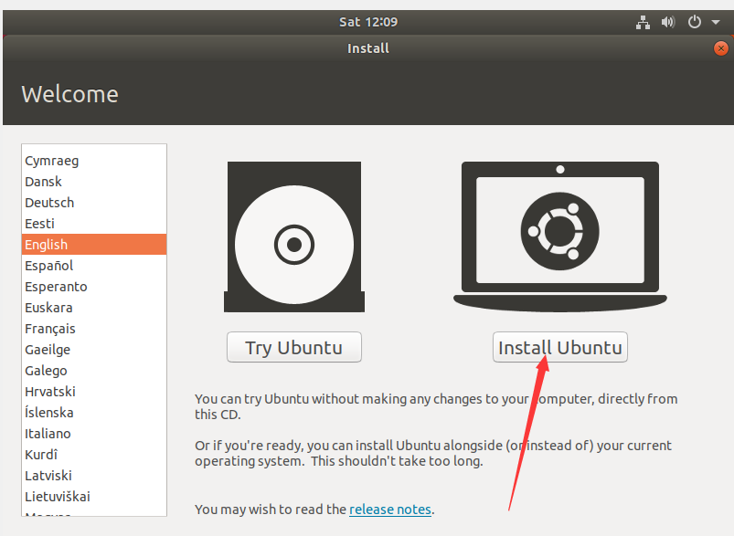
  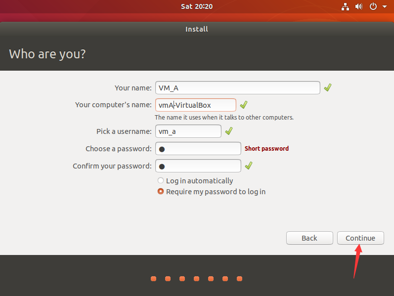
</div>

## 五、安装Ubuntu虚拟机A、B、C

- 重复上述虚拟机创建和安装步骤，分别创建并安装三个Ubuntu虚拟机（A、B、C）.
- Повторите вышеуказанные шаги создания и установки виртуальной машины, чтобы создать и установить три виртуальные машины Ubuntu (A, B, C).
<div align="center">
  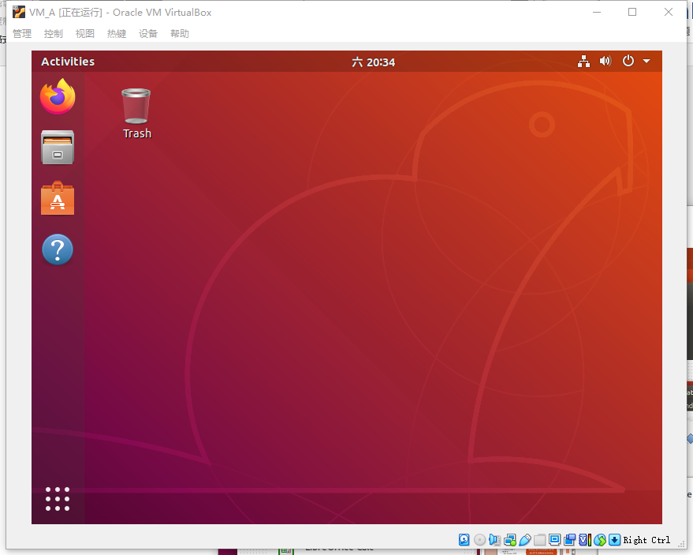
  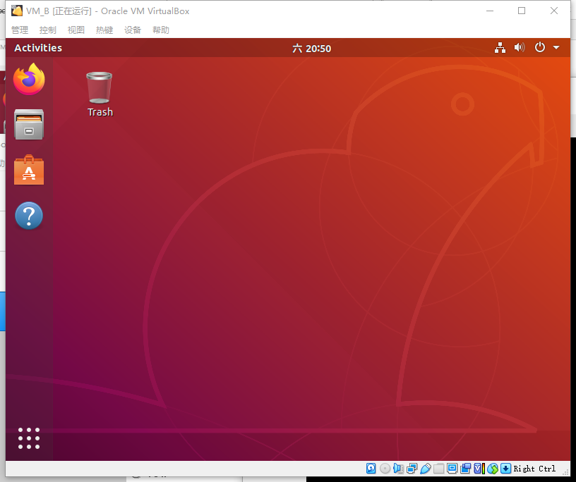
  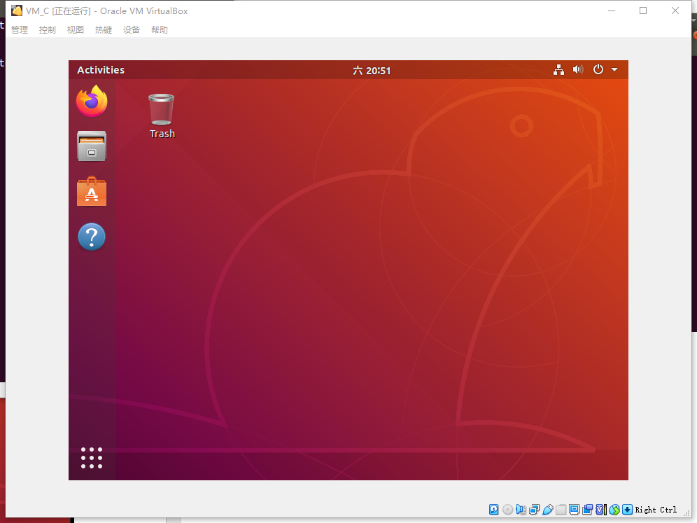
</div>

## 六、环境配置与网络测试

1. **安装net-tools工具**
   - 在每个虚拟机中运行以下命令安装net-tools工具：
     ```bash
     sudo apt update
     sudo apt install net-tools
     ```
   - В каждой виртуальной машине выполните следующие команды для установки инструментов net-tools:
     ```bash
     sudo apt update
     sudo apt install net-tools
     ```
<div align="center">
  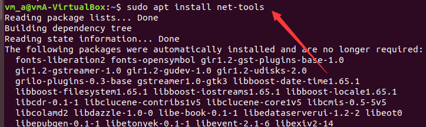
</div>

2. **查看虚拟机IP地址**
   - 使用`ifconfig`命令查看虚拟机的IP地址。
   - IP地址：
     - 虚拟机A的IP地址为：10.0.2.5
     - 虚拟机B的IP地址为：10.0.2.4
     - 虚拟机C的IP地址为：10.0.2.6
   - Используйте команду `ifconfig`, чтобы просмотреть IP-адреса виртуальных машин.
   - IP-адреса:
     - IP-адрес виртуальной машины A: 10.0.2.5
     - IP-адрес виртуальной машины B: 10.0.2.4
     - IP-адрес виртуальной машины C: 10.0.2.6
<div align="center">
  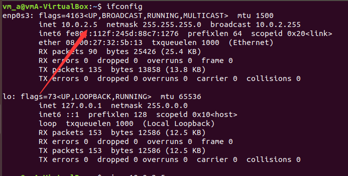
  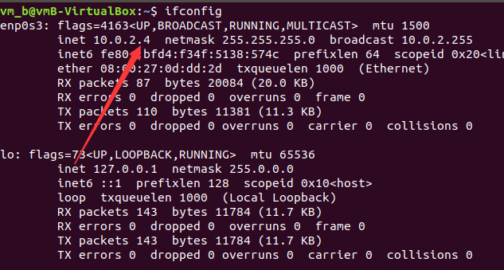
  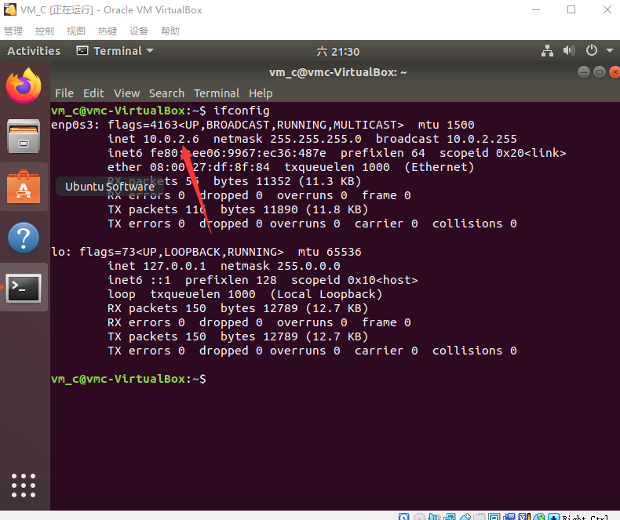
</div>

3. **虚拟机A ping 虚拟机B**
   - 在虚拟机A中运行以下命令测试与虚拟机B的连通性：
     ```bash
     ping 10.0.2.4
     ```
   - 确认能够ping通虚拟机B.
   - В виртуальной машине A выполните следующую команду для проверки соединения с виртуальной машиной B:
     ```bash
     ping 10.0.2.4
     ```
   - Убедитесь, что соединение с виртуальной машиной B установлено.
<div align="center">
  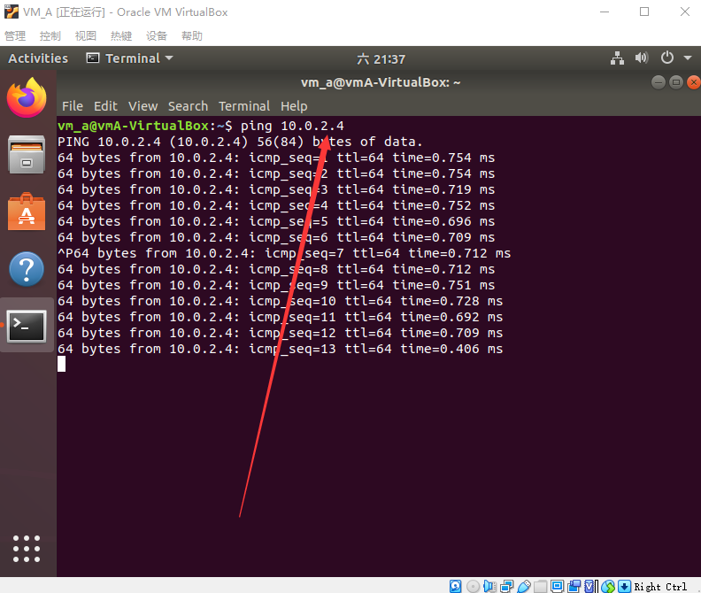
</div>

4. **限制虚拟机B对虚拟机C的访问**
   - 在虚拟机B中运行以下命令使用iptables限制对虚拟机C的访问：
     ```bash
     sudo iptables -A OUTPUT -d 10.0.2.6 -j DROP
     ```
   - 此命令将阻止虚拟机B向虚拟机C发送任何数据包.
   - В виртуальной машине B выполните следующую команду для ограничения доступа к виртуальной машине C с помощью iptables:
     ```bash
     sudo iptables -A OUTPUT -d 10.0.2.6 -j DROP
     ```
   - Эта команда блокирует отправку любых пакетов с виртуальной машины B на виртуальную машину C.
<div align="center">
  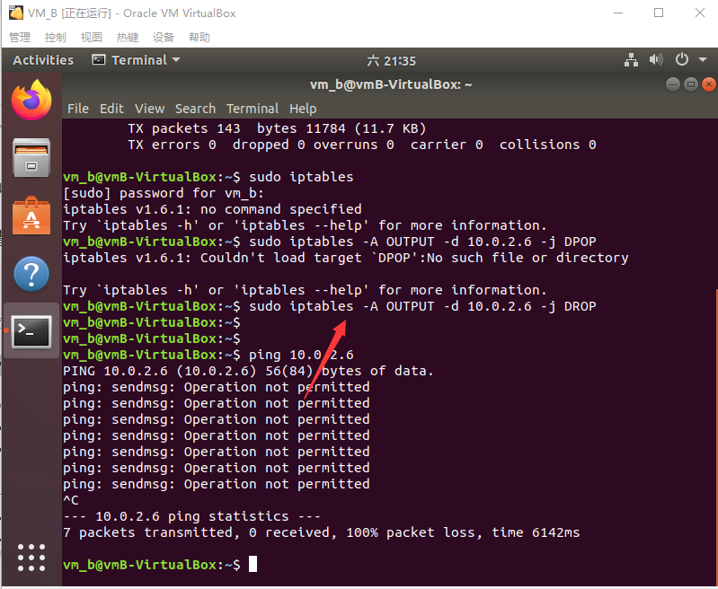
</div>
